# Curso-Mentorama---C-para-jogos

Realização dos Modulos do curso e das implementações realizadas.

**Curso:** C# para Jogos

Acessar os arquivos das atividades na pasta: **Files**

# Modulo 1
Atividade baseada no Conteúdo do modulo1.

Realizei a criação de um fluxograma de um jogo de sinuca.
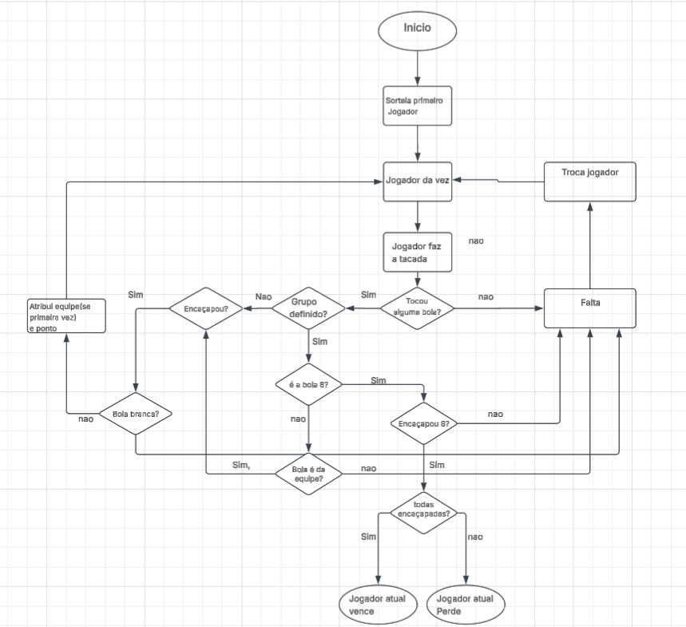

# Modulo 2
Atividade Baseada no Conteúdo do modulo2.

realização de um Script com diversos Operadores aritméticos e comparação, além de métodos de cast de variáveis.

Acesse o script: [modulo1_Script.cs](Folder/Modulo2/modulo1_Script.cs)

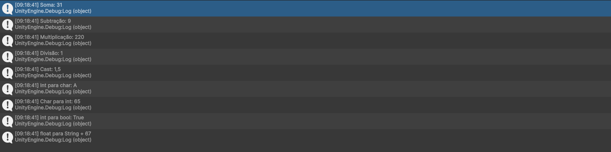

# Modulo 3
Atividade Baseada no Conteúdo do Modulo3.

realização de um script que controla a posição da câmera e do taco e aplica uma força na bola branca, todos feito por função alem da aplicação base de Inputs.

modelagem básica de uma mesa de sinuca.

Acesse o script: [TacoScript.cs](Folder/Modulo3/TacoScript.cs)

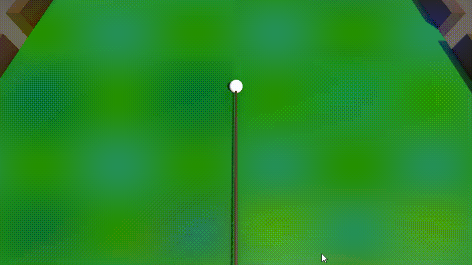

# Modulo 4

Atividade Baseada no Conteúdo do Modulo4.

Continuação do Script do modulo passado porem com a adição de Loops, Destroy e Instantiate, para o reposicionamento do jogo e criação de efeitos especiais, além de um caso a parte do uso de Dictionary.

Implementação de uma nova câmera no cenário.

Acesse o script: [TacoScript.cs](Folder/Modulo4/TacoScript.cs)

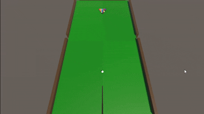

# Modulo 5

Atividade Baseada no Conteúdo do Modulo5.

Continuação do Script do modulo passado porem com a adição de Loops, Destroy e Instantiate, para o reposicionamento do jogo e criação de efeitos especiais, além de um caso a parte do uso de Dictionary.

Implementação de uma nova câmera no cenário.

Acesse o script: [TacoScript.cs](Folder/Modulo5/List_Array.cs)

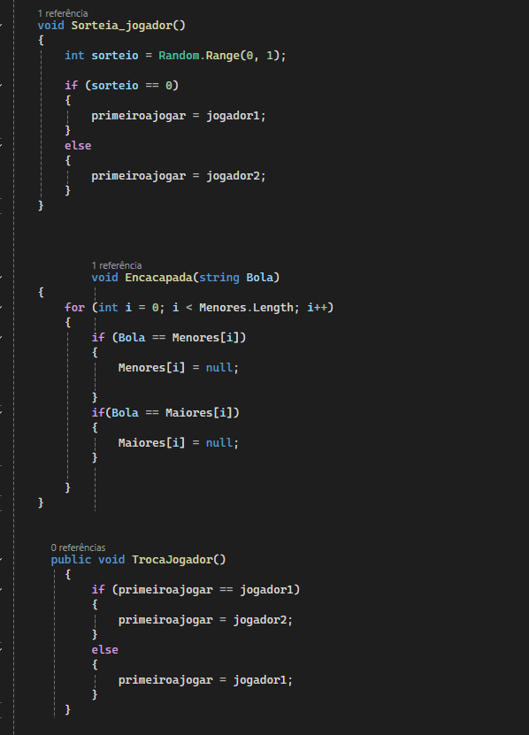

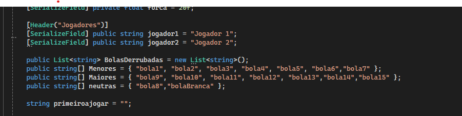
# Modulo 6
Atividade Baseada no Contéudo do Modulo6

Continuação do Script do modulo passado porem agora o codigo foi modificado e adaptado para funcionar utilizando Enum e Struct para sua estrutura, onde o Enum atualmente controla o estado da camera e a Struct controla e armazena todas as informações imutaveis do jogo.

| Enum | Struct|Troca de camera|
|---|---|---|
 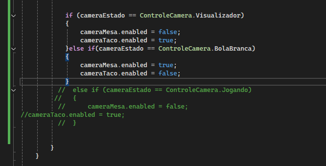 | 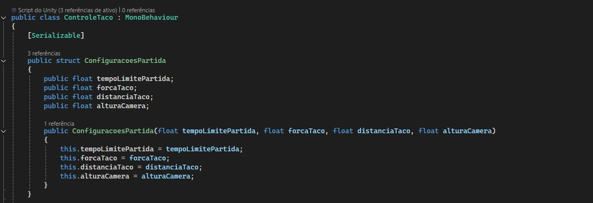| |
# Modulo 7
Atividade Baseada no Contéudo do Modulo7

Continuação do Script e implementação de 1 classe chamada Equipe na qual fica responsavel de gerenciar as informações das equipes participantes da rodada como por exemplo, turnos, vez do jogador, pontos

|Classe Equipe| Utilização da classe|funcoes_equipe|
|---|---|---|
 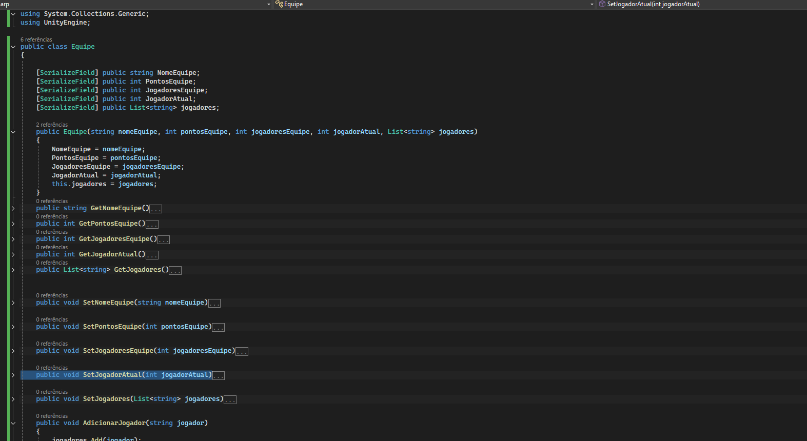 | 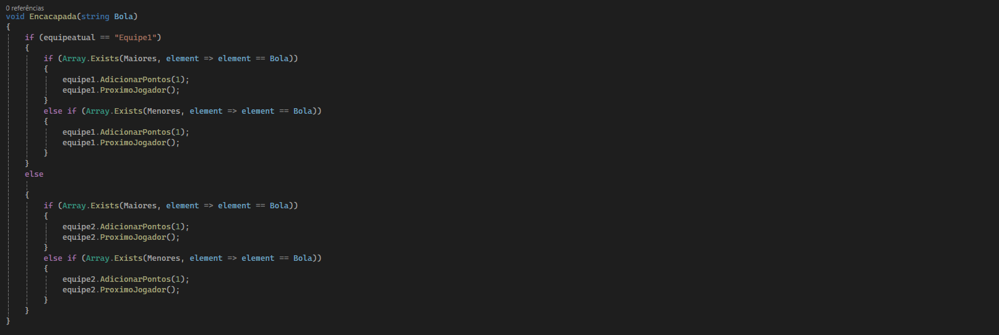| 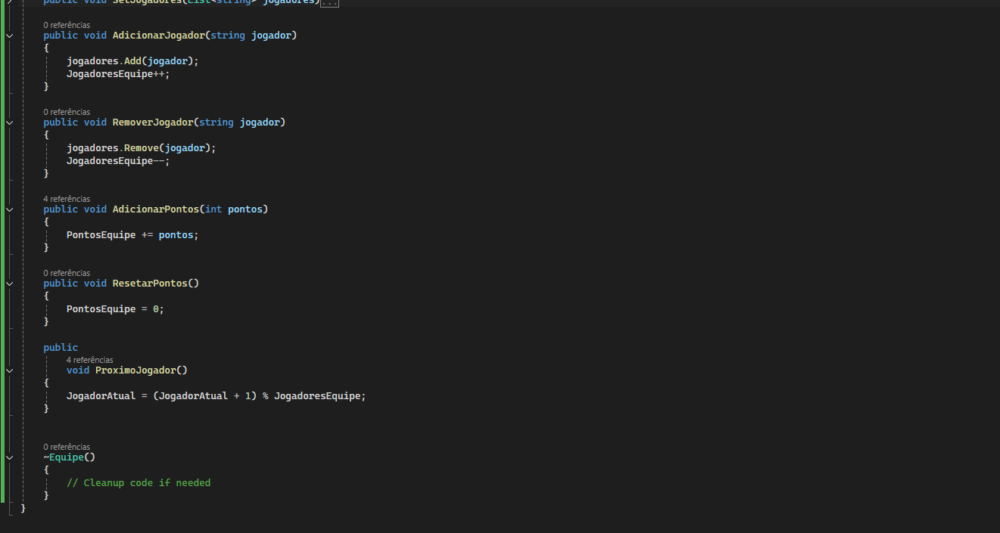|

  Acesse o script Equipe: [Equipe.cs](Folder/Modulo8/Equipe.cs)

# Modulo 8
Atividade Baseada no Contéudo do Modulo8

Continuação do Script e implementação de 3 classes

- Participante : Classe abstrata generica para a criação e herança de outras classes
  
- Solo : Classe que herda de Participante e sobscreve metodos genericos para o caso de jogador solo
  
- Dupla : Classe que herda de Participante e sobscreve metodos genericos para o caso de jogadores em dupla, contem informações extras para gerenciamento de turno

| Duplas | Solo|Participante|
|---|---|---|
 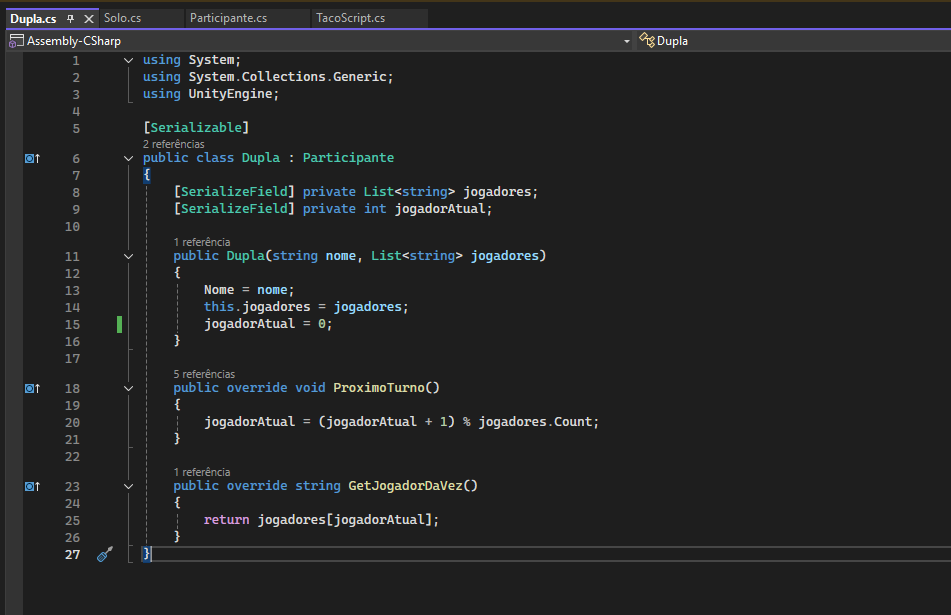 | 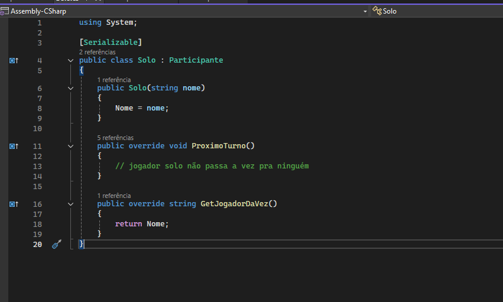| 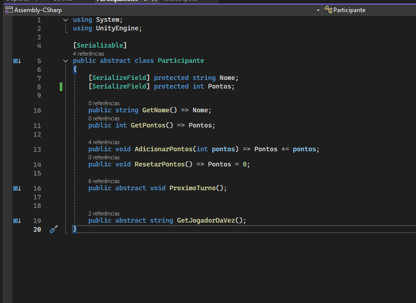|

 Acesse o script Participantes: [Solo.cs](Folder/Modulo8/Participante.cs)
 Acesse o script Solo: [Solo.cs](Folder/Modulo8/Solo.cs)
 Acesse o script Dupla: [Solo.cs](Folder/Modulo8/Dupla.cs)
# Modulo 9
Atividade baseada do Conteudo do modulo9

Criação de metodos eventos e Delegates para comunicação com telas e interações diversas.

| InvokeM9 | TelaView| Tela_mudandoM9 |
|---|---|---|
 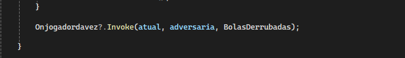 | 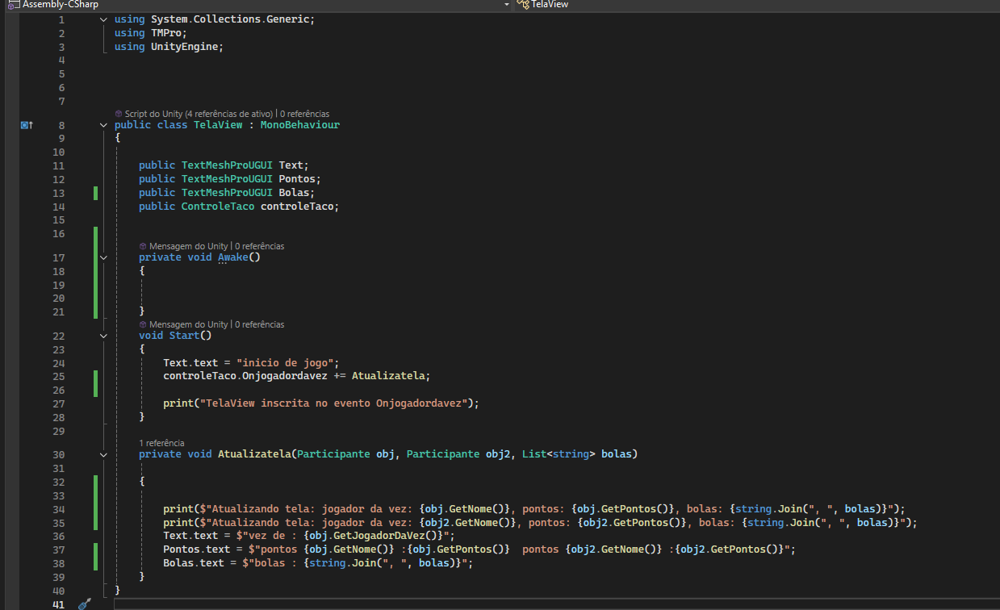| 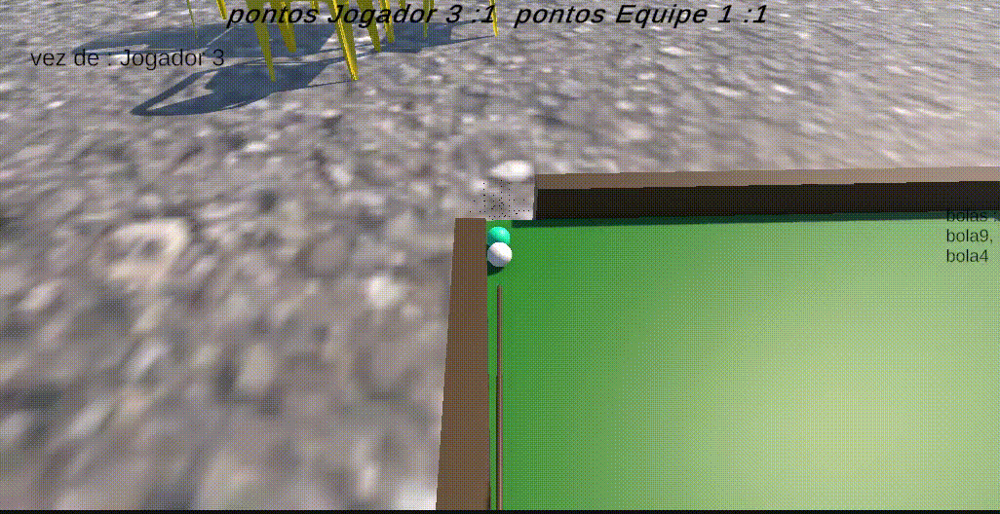|

 Acesse o script Participantes: [TelaView.cs](Folder/Modulo9/TelaView.cs)

# Modulo 10
Atividades baseada no Conteudo do modulo10

Conteudo principal da Unity abordado como, raycast, colliders,Physics, Trigger

| OnCollision | Physics_Material|
|---|---|
  | 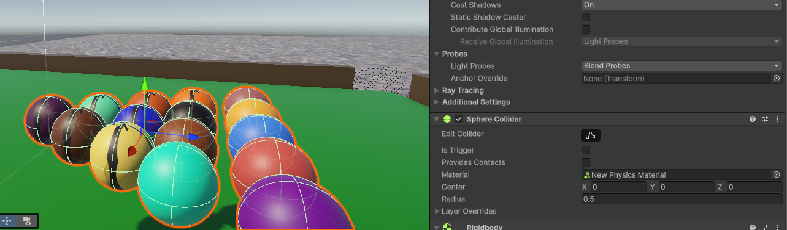|
# Modulo 11
# Modulo 12
Atividade baseada no Conteudodo modulo12

Criando o jogo do Pac-man completo e todas as logicas envolvidas.

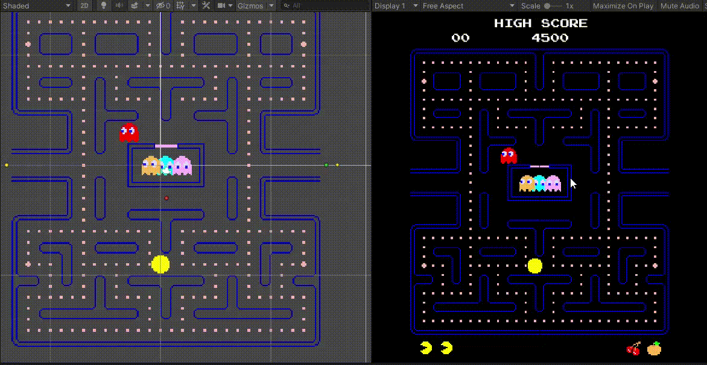

Acesse o script PacMan: [TelaView.cs](Folder/Modulo12)

# Modulo 13
# Modulo 14
# Modulo 15
# Modulo 16
# Modulo 17
# Modulo 18
# Modulo 19
# Modulo 20
